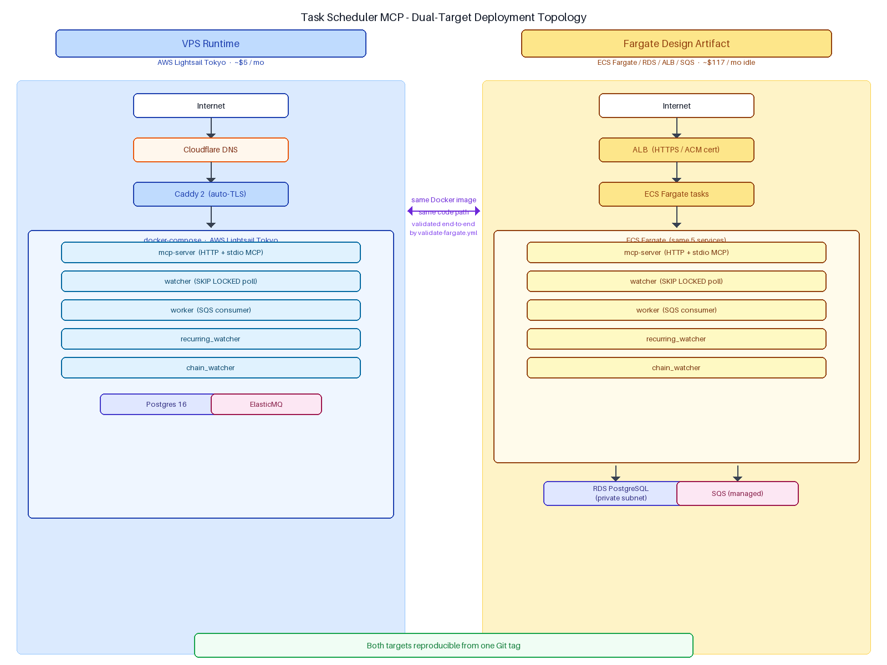

# Task Scheduler MCP

**🌐 English** | [繁體中文](README.zh-TW.md)

A self-hostable MCP server that runs as a persistent HTTP service — **5 tools · 7 actions · 4 resources · 2 prompts** — so LLM clients can schedule, chain, and cancel recurring tasks backed by Postgres + SQS.

[](https://github.com/PaynePew/task_scheduler_mcp/actions) [](https://scheduler.paynepew.dev) [](https://status.paynepew.dev)

---

## §1 Who this is for

Built for: developers who run their own webhooks/APIs and want to schedule them via natural-language LLM chat, with auditable persistence beyond chat sessions.

**Supported MCP clients:** Claude Desktop · Cursor · Claude in Chrome · MCP Inspector
**Not supported:** ChatGPT (Custom GPT Actions ≠ MCP protocol)

---

## §2 Architecture


The MCP server persists `Job` + `JobRun` rows. The **Watcher** claims due runs via `FOR UPDATE SKIP LOCKED` and enqueues them. The **Worker** dispatches to one of 7 typed **ActionHandlers** (`echo` · `http_call` · `slack_post` · `github_digest` · `email_send` · `r2_upload` · `calendar_digest_ics`). **ChainWatcher** and **RecurringJobWatcher** consume the append-only `run_events` outbox — they never poll mutable state.

---

## §3 How to use

### Self-host (recommended)

```bash
git clone https://github.com/PaynePew/task_scheduler_mcp
cd task_scheduler_mcp && cp .env.example .env
docker compose --profile full up -d
```

Claude Desktop config (`~/Library/Application Support/Claude/claude_desktop_config.json`):

```json
{ "mcpServers": { "task-scheduler": {
  "url": "http://localhost:8000/mcp",
  "transport": "streamable-http",
  "headers": { "X-User-Id": "me" }
}}}
```

**BYO LLM via `http_call` + `${ANTHROPIC_API_KEY}`:** set `action: "http_call"` and reference `${ANTHROPIC_API_KEY}` in headers or body — substituted from env at run time ([ADR-032](docs/adr/ADR-032-secrets-aware-action-handlers-and-env-var-substitution.md)); add the key name to `HTTP_CALL_ENV_WHITELIST`. Rate limit: **1 000 creates/24h · 10/min burst** — env-configurable ([ADR-042](docs/adr/ADR-042-postgres-backed-rate-limiting.md)).

For always-on hosting: `bin/setup-vps.sh` on a fresh Ubuntu 24.04 box (Docker + Caddy + ufw + nightly Postgres backup + systemd restart on reboot).

### Public demo (click-through only)

`scheduler.paynepew.dev/` serves a landing page ([ADR-041](docs/adr/ADR-041-static-landing-page-and-caddy-path-routing.md)). The live MCP endpoint:

```bash
curl https://scheduler.paynepew.dev/healthz   # → {"ok":true,"db":"connected"}
MCP_USER_ID=demo npx @modelcontextprotocol/inspector https://scheduler.paynepew.dev/mcp
```

No auth — anyone can read your jobs by guessing your `X-User-Id`. Self-host for anything that matters. Browse: [ADRs](docs/adr/) · [PRDs](docs/PRD/) · [Design Decisions](#design-decisions-adrs)

---

## §4 Why HTTP, not stdio

Stdio MCPs are child processes — they die when the chat closes. A scheduler must fire at wall-clock times regardless of which client is open. See [ADR-006](docs/adr/ADR-006-mcp-transport-dual-stdio-http.md).

---

## §5 Deployment Architecture



| | VPS (runtime — live) | Fargate (design artifact) |
|---|---|---|
| **Platform** | AWS Lightsail Tokyo | ECS Fargate / RDS / ALB / SQS |
| **Monthly cost** | ~$5 | ~$117–145 idle |
| **TLS** | Caddy auto-ACME | ACM + ALB |
| **Data** | Postgres in container + R2 backup | RDS Multi-AZ-ready |
| **Validated by** | Every CI/CD push | `validate-fargate.yml` (W4) |

---

## §6 Roadmap

| Gate | Description | Status |
|---|---|---|
| G1 | CI green; test coverage targets met | ✅ |
| G2 | 5 new handlers in registry; `task.list_actions.v1` returns 7 | ✅ |
| G3 | Digest workflow live — ≥ 5 consecutive Slack messages on production VPS | ✅ |
| G4 | `tasks://recent-results` queryable; returns real 24h data | ✅ |
| G5 | Landing page live — `curl https://scheduler.paynepew.dev/` returns 200 + HTML | ✅ |
| G6 | Rate limiting — integration test: 1001st create rejected | ✅ |
| G7 | Fargate evidence — dry + recording runs green; bill < $5 | ✅ |
| G8 | Visual artifacts — hero GIF + 4 screenshots + 3 diagrams in README | ✅ |
| G9 | README polished + i18n — EN + zh-TW, ~150 lines | ✅ |
| G10 | ADR cluster — 13 new W4 ADRs merged | ✅ |

---

## §7 Design Decisions (ADRs)

W1 scope + language + data store + queue + schema + module layout ([ADR-001–023](docs/adr/)):

| ADR | Decision |
|---|---|
| [ADR-001](docs/adr/ADR-001-project-scope.md) | Project scope |
| [ADR-002](docs/adr/ADR-002-implementation-language-python.md) | Python |
| [ADR-003](docs/adr/ADR-003-primary-data-store-postgres.md) | Postgres as primary store |
| [ADR-006](docs/adr/ADR-006-mcp-transport-dual-stdio-http.md) | Dual stdio + HTTP MCP transport |
| [ADR-007](docs/adr/ADR-007-watcher-ha-skip-locked.md) | Watcher HA via `SKIP LOCKED` |
| [ADR-008](docs/adr/ADR-008-message-queue-sqs.md) | SQS / ElasticMQ queue |
| [ADR-009](docs/adr/ADR-009-database-schema-outbox.md) | 3-table schema + transactional outbox |
| [ADR-013](docs/adr/ADR-013-action-catalog-typed-registry.md) | Typed action registry |
| [ADR-014](docs/adr/ADR-014-mcp-tool-surface-v1.md) | MCP tool surface v1 |
| [ADR-018](docs/adr/ADR-018-no-server-side-llm-in-w2.md) | No server-side LLM in W2 |
| [ADR-018-amended](docs/adr/ADR-018-amended-w4-reconsidered-stays-llm-agnostic.md) | W4 reconsidered — stays LLM-agnostic |

W3 deployment cohort ([ADR-024–031](docs/adr/)):

| ADR | Decision |
|---|---|
| [ADR-024](docs/adr/ADR-024-tier-scoping-and-w3-cut-scope.md) | W3 tier scoping |
| [ADR-025](docs/adr/ADR-025-network-topology-w3-public-ecs-private-rds.md) | Network topology |
| [ADR-026](docs/adr/ADR-026-ecs-service-topology-and-replica-count.md) | ECS service topology |
| [ADR-027](docs/adr/ADR-027-deployment-target-pivot-vps-first-aws-as-design-artifact.md) | VPS-first runtime; Fargate as design artifact |
| [ADR-028](docs/adr/ADR-028-caddy-over-nginx-for-vps-reverse-proxy.md) | Caddy over nginx |
| [ADR-029](docs/adr/ADR-029-vps-deployment-mechanics-ghcr-push-ssh-pull-containerized-data.md) | VPS deployment mechanics |
| [ADR-030](docs/adr/ADR-030-vps-operational-concerns-backup-monitoring-fargate-validation.md) | Operational concerns |
| [ADR-031](docs/adr/ADR-031-monitoring-better-stack-over-uptimerobot.md) | Better Stack monitoring |

W4 action sprint cohort:

| ADR | Decision |
|---|---|
| [ADR-032](docs/adr/ADR-032-secrets-aware-action-handlers-and-env-var-substitution.md) | Secrets via env-var substitution |
| [ADR-033](docs/adr/ADR-033-inter-handler-data-flow-via-job-run-result.md) | Inter-handler data plane via `JobRun.result` |
| [ADR-037](docs/adr/ADR-037-tasks-recent-results-mcp-resource-as-briefing-surface.md) | `tasks://recent-results` briefing surface |
| [ADR-038](docs/adr/ADR-038-mcp-call-as-future-direction.md) | Worker as MCP client *(Deferred — v2)* |
| [ADR-039](docs/adr/ADR-039-plan-abstraction-as-future-direction.md) | Plan abstraction *(Deferred — v2)* |
| [ADR-040](docs/adr/ADR-040-predicate-based-chain-as-future-direction.md) | Predicate-based chain *(Deferred — v2)* |
| [ADR-041](docs/adr/ADR-041-static-landing-page-and-caddy-path-routing.md) | Static landing page + Caddy path routing |
| [ADR-042](docs/adr/ADR-042-postgres-backed-rate-limiting.md) | Postgres-backed rate limiting |
| [ADR-044](docs/adr/ADR-044-project-rename-to-task-scheduler-mcp.md) | Project rename to `task_scheduler_mcp` |
| [ADR-045](docs/adr/ADR-045-email-send-action-design.md) | `email_send` SMTP action |
| [ADR-046](docs/adr/ADR-046-r2-upload-action-design.md) | `r2_upload` Cloudflare R2 / S3-compatible action |
| [ADR-048](docs/adr/ADR-048-calendar-digest-ics-action-design.md) | Calendar digest via signed ICS URL |

---

## §8 MCP Surface

**Tools (5):** `task.create.v1` · `task.list.v1` · `task.status.v1` · `task.cancel.v1` · `task.list_actions.v1`

**Actions (7):** `echo` · `http_call` · `slack_post` · `github_digest` · `email_send` · `r2_upload` · `calendar_digest_ics`

**Resources (4):** `tasks://list` · `tasks://actions` · `tasks://job/{job_id}` · `tasks://recent-results` *(24h result briefing)*

**Prompts (2):** `daily_review` · `setup_summary`

**Features:** cron recurrence · job chaining (`trigger_on_job_id`) · cancel semantics · `${VAR}` env-var substitution · rate limiting

---

## §9 Local Development

```bash
uv sync && cp .env.example .env
docker compose up -d postgres elasticmq
uv run pytest -m "not integration" && uv run pytest -m integration
uv run ruff check . && uv run ruff format --check .
```

```bash
MCP_USER_ID=local-dev MCP_USER_TZ=UTC \
  npx @modelcontextprotocol/inspector uv run python -m app.entrypoints.mcp_stdio
```

Expected in inspector: **5 tools · 4 resources · 2 prompts** (W4 complete). See [docs/W2-VERIFICATION.md](docs/W2-VERIFICATION.md).
