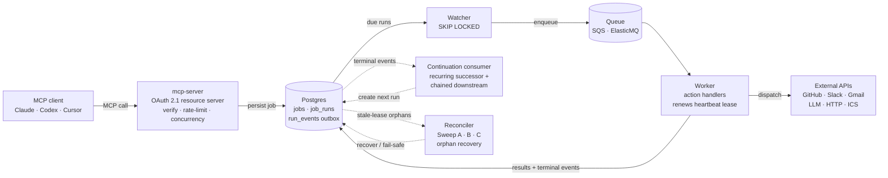
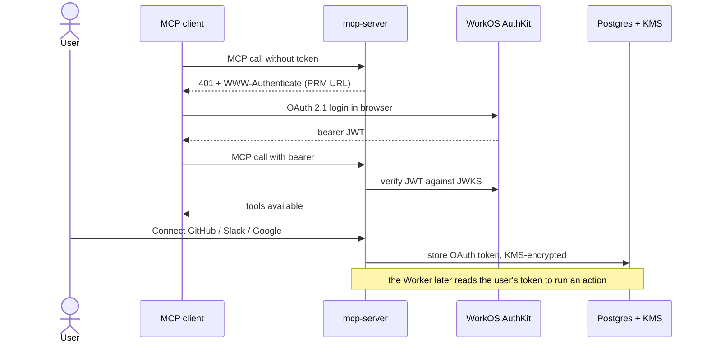

# Owl Task Scheduler MCP

**English** | [繁體中文](README.zh-TW.md)

A self-hostable, multi-tenant MCP server that turns a natural-language chat into durable scheduled jobs. You tell Claude or Codex "every weekday at 9am, summarize my GitHub issues and post them to Slack", and the job keeps firing on schedule long after you close the chat. Backed by Postgres and SQS, running live on a $5 VPS.

[](https://github.com/PaynePew/task_scheduler_mcp/actions) [](https://scheduler.paynepew.dev) [](https://status.paynepew.dev)

---

## What it is

Most MCP servers run over stdio, so they live and die with the chat window. A scheduler can't work that way: a job that fires "every Monday at 10am" has to run whether or not a chat is open. So this runs as a persistent HTTP service with its own database and worker pool. The chat client just creates and queries jobs over MCP; the server does the actual scheduling on wall-clock time.

A live multi-tenant instance runs at [scheduler.paynepew.dev](https://scheduler.paynepew.dev). It authenticates each user through OAuth 2.1, runs actions with that user's own scoped tokens, and keeps a single small box safe with quotas, rate limits, and load shedding. Connect to it in about two minutes, or clone the repo and run the whole stack yourself.

**Supported clients:** Claude Desktop, Claude Code, Codex CLI, Cursor, MCP Inspector.

## Key technical points

- Persistence is the whole point. Jobs survive the chat session because the scheduler is a long-lived HTTP service with its own database, not a subprocess that dies with the client ([ADR-006](docs/adr/ADR-006-mcp-transport-dual-stdio-http.md)).
- Real auth, not a header. The public endpoint is an OAuth 2.1 resource server, with WorkOS AuthKit as the authorization server. A user's identity is a verified JWT subject, so one user can never read or cancel another's jobs ([ADR-053](docs/adr/ADR-053-layer1-authorization-server-workos-authkit.md), [ADR-049](docs/adr/ADR-049-public-product-multi-tenant-oauth-delegation.md)).
- Your raw secret is never stored. GitHub, Slack, and Gmail actions run on per-user OAuth tokens that are scoped, revocable, and encrypted at rest with AWS KMS envelope encryption, then refreshed automatically when they expire ([ADR-054](docs/adr/ADR-054-layer2-token-storage-aws-kms-envelope-encryption.md)).
- The data model is built to avoid races. Every status change is written to an append-only outbox in the same transaction, and the follow-up consumers read that event log instead of polling mutable state ([ADR-009](docs/adr/ADR-009-database-schema-outbox.md)). A recurring or chained run is created only when its upstream run reaches a terminal event — *continuation* — and exactly-once is enforced by a Postgres unique index rather than a distributed lock, so nothing can double-spawn ([ADR-067](docs/adr/ADR-067-continuation-chaining-replaces-pre-armed-waiting-runs.md)).
- It runs on $5/month and stays up under load. Watchers claim work with `FOR UPDATE SKIP LOCKED` so several can run with no leader election. The server sheds load at the edge, caps concurrency, and applies backpressure when the queue is deep ([ADR-007](docs/adr/ADR-007-watcher-ha-skip-locked.md), [ADR-057](docs/adr/ADR-057-overload-protection-load-shedding-concurrency.md)).
- A crashed worker can't wedge a job. Every `RUNNING` run renews a `heartbeat_at` lease, so the reconciler can tell a slow-but-alive run from a dead one and recover only true orphans — re-running idempotent actions and failing non-idempotent ones safely — which frees the job's quota and resumes its recurrence. `email_send` is *effectively-once*: a run-derived idempotency key plus a write-ahead intent record make a redelivered send a no-op, not a duplicate. At-least-once delivery + an idempotent consumer is the honest guarantee for an external side effect ([ADR-069](docs/adr/ADR-069-running-orphan-recovery-and-heartbeat-lease.md), [ADR-070](docs/adr/ADR-070-email-send-effectively-once-posture.md)).
- Every decision is written down. 60+ ADRs cover scope, language, data store, transport, auth, and the security model, so the reasoning is auditable rather than tribal.

## Architecture

Two views. The first is the job lifecycle: how a request becomes a scheduled run that fires on time. The second is the auth and secrets handshake that happens before any of it.

### Runtime



A tool call reaches `mcp-server` through Caddy. The server verifies the bearer token, checks the caller's rate limit and quota, and writes a `Job` (and, for a scheduled job, its first `JobRun` — a chained job gets no run until its trigger fires). The **Watcher** scans for runs due within the next five minutes and claims them with `FOR UPDATE SKIP LOCKED`, so several watchers can run at once without stepping on each other. Claimed runs go onto the queue, and the **Worker** pulls one, dispatches it to the matching typed action handler, then writes the result and a status event back to Postgres.

The follow-up consumers never poll the mutable status column — they read the append-only `run_events` outbox. The **Continuation consumer** reacts to each terminal event: in the same transaction it materializes the next recurring occurrence *and* creates a `PENDING` run for every chained downstream whose trigger just fired (continuation), then settles the finished job's `Job.state`. It replaced the old `RecurringJobWatcher` + `ChainWatcher` pair (ADR-067). The **Reconciler** is the last line of defense: three idempotent sweeps run under `SKIP LOCKED` — it fails stuck `RETRYING` runs (A), re-enqueues due `QUEUED` runs the queue dropped (B), and recovers `RUNNING` runs orphaned by a worker crash (C). It tells a dead worker from a slow one by the `heartbeat_at` lease the worker renews while it holds a run, and recovers each orphan by its action's idempotency posture — re-running what is safe to repeat, failing-safe and alerting on what is not ([ADR-069](docs/adr/ADR-069-running-orphan-recovery-and-heartbeat-lease.md)).

### Auth and secrets



An unauthenticated call gets a `401` and a `WWW-Authenticate` challenge that points at the Protected Resource Metadata endpoint (RFC 9728), which is how the client discovers the login flow. After the browser login, the client sends a WorkOS bearer JWT that the server verifies against the JWKS. Connecting an app is a separate per-provider OAuth consent on `/connections`; the resulting token is encrypted and stored, and the worker reads it at run time.

## Tech stack

| Layer | Choice |
|---|---|
| Language & tooling | Python 3.12, [uv](https://docs.astral.sh/uv/) for deps/venvs, [ruff](https://docs.astral.sh/ruff/) lint + format |
| MCP | Official [`mcp`](https://github.com/modelcontextprotocol/python-sdk) Python SDK — dual transport: stdio + streamable HTTP |
| Web / API | Starlette + uvicorn (ASGI) for the HTTP transport, the `/connections` OAuth dashboard, and the static landing page |
| Data | PostgreSQL 16, SQLAlchemy 2.0 async (asyncpg), Alembic migrations, an append-only `run_events` outbox |
| Queue | Amazon SQS in production, [ElasticMQ](https://github.com/softwaremill/elasticmq) locally — same boto3 client |
| Identity | [WorkOS AuthKit](https://workos.com/) as the OAuth 2.1 authorization server; this app is a resource server (PyJWT + JWKS, RFC 8707/9728) |
| Secrets | AWS KMS envelope encryption for per-user OAuth tokens (boto3 + cryptography) |
| Scheduling & config | `croniter` for cron expansion; pydantic v2 + pydantic-settings |
| Action I/O | `httpx` (GitHub/Slack/Gmail/LLM), `icalendar` (ICS), operator-funded LLM pinned to `gpt-4o-mini` |
| Observability | Structured JSON logs (`python-json-logger`) → Better Stack; `/healthz` reports the running commit SHA |
| Infra | Docker Compose (8 services), Caddy (automatic TLS), AWS Lightsail (Tokyo, ~$5/mo), Cloudflare R2 (nightly backups) |
| CI/CD | GitHub Actions — lint + unit + integration, then auto-deploy to the VPS over SSH on a green `main` |
| Tests | pytest (+asyncio, +cov), moto (AWS mocks), aiosmtpd (SMTP capture) |

## Quick start

There are three ways to connect, and they use different transports and different identity sources. Mixing them is the most common setup mistake, so pick one path and follow it all the way down.

|                    | A. Hosted                                | B. Self-host (HTTP)                  | C. Self-host (stdio)                       |
|--------------------|------------------------------------------|-------------------------------------|--------------------------------------------|
| MCP transport      | streamable HTTP over TLS                 | streamable HTTP                     | stdio subprocess                           |
| MCP endpoint       | `https://scheduler.paynepew.dev/mcp`     | `http://localhost:8000/mcp`         | `uv run python -m app.entrypoints.mcp_stdio` |
| Who you are        | WorkOS OAuth (verified JWT `sub`)        | `X-User-Id` header (trust-only)     | `MCP_USER_ID` env var (trust-only)         |
| Connect apps at    | `scheduler.paynepew.dev/connections`     | `localhost:8000/connections`        | `localhost:8000/connections`               |
| What to run first  | nothing                                  | `docker compose --profile full up -d` | same compose stack, then on-demand stdio   |

> The trust-only `X-User-Id` and `MCP_USER_ID` paths believe whatever you tell them. They are fine for your own machine, but never expose them to the public internet: anyone who guesses the header reads your jobs. The hosted path uses real OAuth instead.

When an action needs an OAuth connection you haven't set up, the server replies with a `MISSING_CONNECTION` error and a `connect_url` built from its own `CONNECTIONS_BASE_URL`. If your client points at the hosted server but you try to connect apps on a local one (or the reverse), the two sides hold different identities and every action quietly fails. Keep both ends on the same path.

### A. Hosted: nothing to install

This is the fastest way to try it. Two minutes, no clone.

**Claude Desktop** (Settings, Connectors, Add custom connector): name it `owl-scheduler`, URL `https://scheduler.paynepew.dev/mcp`, leave the rest blank. Click Connect, sign in through the browser window, and the tools appear in chat. Full walkthrough: [docs/guides/claude-desktop-quickstart.md](docs/guides/claude-desktop-quickstart.md).

**Claude Code:**

```bash
claude mcp add --transport http owl-scheduler https://scheduler.paynepew.dev/mcp
```

**Codex CLI** (`~/.codex/config.toml`):

```toml
[mcp_servers.owl-scheduler]
url = "https://scheduler.paynepew.dev/mcp"
```

Then run `codex mcp login owl-scheduler` to do the browser sign-in.

After signing in, open [scheduler.paynepew.dev/connections](https://scheduler.paynepew.dev/connections), check the name at the top matches the account you just used, and click Connect for GitHub, Slack, or Google as needed. Health check: `curl https://scheduler.paynepew.dev/healthz` returns `{"ok":true,"db":"connected"}`.

### B. Self-host over HTTP: the production path

```bash
git clone https://github.com/PaynePew/task_scheduler_mcp
cd task_scheduler_mcp
cp .env.docker.example .env.docker   # compose reads THIS file, not .env
cp .env.example .env                 # only for host-side uv (tests, alembic)
docker compose --profile full up -d
```

That brings up eight services: Postgres, ElasticMQ, a one-shot migrator, `mcp-server`, the watcher, the worker, the continuation consumer (the `recurring-watcher` service), and the reconciler.

Point your client at the local endpoint. The `X-User-Id` header is your identity in trust-only mode.

```bash
# Claude Code
claude mcp add --transport http owl-scheduler http://localhost:8000/mcp --header "X-User-Id: me"
```

```toml
# Codex CLI config: ~/.codex/config.toml
[mcp_servers.owl-scheduler]
url = "http://localhost:8000/mcp"
http_headers = { "X-User-Id" = "me" }
```

Open `http://localhost:8000/connections`, confirm it says `Signed in as me` (matching your header), and connect each provider. To put this on the public internet, edit `.env.docker`:

- Set `CONNECTIONS_BASE_URL=https://yourdomain.tld` so OAuth callbacks and metadata use the public host.
- Configure WorkOS so the public endpoint requires a real bearer token instead of trust-only headers.
- On a fresh Ubuntu 24.04 box, `bin/setup-vps.sh` installs Docker, Caddy with automatic TLS, a firewall, a nightly Postgres backup, and systemd auto-restart.

Bring your own LLM through `http_call`: set `action: "http_call"`, reference `${ANTHROPIC_API_KEY}` in the headers or body (it is substituted at run time, [ADR-032](docs/adr/ADR-032-secrets-aware-action-handlers-and-env-var-substitution.md)), and add the variable name to `ALLOWED_TEMPLATE_VARS`. Per-user creation limit defaults to 100 jobs/day with a 5/minute burst, all configurable ([ADR-055](docs/adr/ADR-055-public-abuse-cost-containment-posture.md)).

### C. Self-host over stdio: Inspector and dev convenience

A stdio MCP server is a subprocess that dies with the chat ([see below](#why-http-not-stdio) for why that's usually wrong for a scheduler). Use it for MCP Inspector debugging or short dev runs. The OAuth dashboard still lives in the HTTP web tier, so you bring the stack up anyway:

```bash
cp .env.docker.example .env.docker
cp .env.example .env
docker compose --profile full up -d   # web tier for /connections, plus Postgres and queue
```

```toml
# Codex CLI config: ~/.codex/config.toml
[mcp_servers.owl-scheduler]
command = "uv"
args = ["run", "python", "-m", "app.entrypoints.mcp_stdio"]
cwd = "/path/to/task_scheduler_mcp"
env = { MCP_USER_ID = "me", MCP_USER_TZ = "UTC" }
```

```jsonc
// Claude Desktop / Cursor: the client spawns the process on demand
{ "mcpServers": { "owl-scheduler": {
  "type": "stdio",
  "command": "uv",
  "args": ["run", "python", "-m", "app.entrypoints.mcp_stdio"],
  "env": { "MCP_USER_ID": "me", "MCP_USER_TZ": "UTC" }
}}}
```

The stdio process and the web tier each read `MCP_USER_ID` from their own environment. They must resolve to the same string, or you connect apps as one user and the stdio process queries another. Open `http://localhost:8000/connections` and confirm `Signed in as me` matches the `MCP_USER_ID` you passed in.

MCP Inspector against the stdio entrypoint:

```bash
MCP_USER_ID=local-dev MCP_USER_TZ=UTC \
  npx @modelcontextprotocol/inspector uv run python -m app.entrypoints.mcp_stdio
```

### Why HTTP, not stdio

A stdio MCP server is a child process of the chat client, so it stops the moment the chat closes. A scheduler has to fire at wall-clock times no matter which client is open, which only a long-lived service can do. The codebase keeps both transports because stdio is genuinely useful for local debugging and for the operator's own low-friction access. See [ADR-006](docs/adr/ADR-006-mcp-transport-dual-stdio-http.md).

## The MCP surface

**Tools (5):** `task.create.v1`, `task.list.v1`, `task.status.v1`, `task.cancel.v1`, `task.list_actions.v1`. A tool is what the LLM client invokes; `task.create.v1` takes an `action` field naming one of the handlers below.

**Actions (6):** what the worker actually executes, grouped by how they get credentials. All six are available to every user.

| Action | Needs | What it does |
|---|---|---|
| `github_digest` | your GitHub | Pulls your issues and PRs for a repo. Good upstream for a digest. |
| `slack_post` | your Slack | Posts a message to a channel in your workspace. |
| `email_send` | your Google | Sends mail from your Gmail. Supports digest chaining. Effectively-once — a redelivered send is de-duplicated, not doubled. |
| `llm_summarize` | nothing | Summarizes text or an upstream result; chain to `slack_post` or `email_send` to deliver the output. Fixed prompt, token and budget caps. |
| `llm_polish` | nothing | Rewrites text more cleanly (tone & language); chain to `slack_post` or `email_send` to deliver the output. Fixed prompt, token and budget caps. |
| `echo` | nothing | Echoes input back. Smoke test for create and dispatch. |

The OAuth-backed actions run on each user's own scoped token. The two LLM actions run a fixed, cost-capped transform: no free-form prompt and no `${VAR}`. The model is pinned to a cheap one (`gpt-4o-mini`) with a hard per-call output-token limit plus per-user daily and global monthly budget ceilings, so cost stays bounded ([ADR-052](docs/adr/ADR-052-operator-subsidized-llm-actions-fixed-prompt-and-caps.md)). Their output feeds a downstream handler via the internal data plane — no MCP surface returns it to the caller. Chain `llm_polish` or `llm_summarize` to `slack_post` or `email_send` to actually receive the result.

> Self-host extras (operator-only): `http_call` and `calendar_digest_ics` exist for the deployer's own use. They still appear in `task.list_actions`, but on the hosted instance `task.create` rejects them for everyone but the operator ([ADR-051](docs/adr/ADR-051-action-surface-tiering-public-oauth-vs-operator-only.md)).

**Resources (4):** `tasks://list`, `tasks://actions`, `tasks://job/{job_id}`, `tasks://recent-results` (last 24h of completed runs, useful as an on-connect briefing).

**Prompts (2):** `daily_review`, `setup_summary`.

**Scheduling features:** immediate, one-shot (`scheduled_at`), and recurring (`cron_expr`, including `@daily`/`@hourly` shortcuts) jobs; job chaining (`trigger_on_job_id` with a `trigger_on_status` predicate — `SUCCEEDED` / `FAILED` / `ANY`) that can fan out and threads upstream output downstream; `task.status` surfaces a chained job's `triggered_by` parent; cancel semantics (cancelling an upstream stops its whole downstream pipeline); per-user rate limits and quotas.

## Example prompts

Talk to it in natural language. Connect GitHub, Slack, and Google at `/connections` first, then replace `<owner>/<repo>` and the channel / email with your own. If your client reaches for its built-in scheduler instead, start with **"use owl-scheduler to …"**.

The ladder below climbs from a one-line smoke test to a self-firing multi-service pipeline. The same order works as a **live demo** (each rung builds on the last) and as a first-run tour after you clone.

### Warm up — no accounts needed

1. **Discover** — *"Using owl-scheduler, what can you do?"*
   `task.list_actions` — lists every action and which ones need a connection.

2. **Echo (smoke test)** — *"Echo 'hello from owl-scheduler' right now."*
   `immediate` + `echo`. Proves create → dispatch → result end to end. Verify: `task.status` shows `completed` within a few seconds.

### Single actions

3. **Immediate digest** — *"Right now, pull the open issues and stale PRs for `<owner>/<repo>` and summarize them."* (needs GitHub)
   `immediate` + `github_digest`. Read-only — nothing leaves the box. Verify: result in ~10 s via `task.status`.

4. **LLM polish → Slack** — *"Right now, rewrite this rough release note — 'fixed the login bug, added dark mode, the api is faster now' — into a professional announcement and post it to Slack `#announcements`."* (needs Slack)
   `immediate` + `llm_polish → slack_post`. `llm_polish` is an operator-funded, fixed-prompt, cost-capped rewrite — **no API key needed**. Its output is never returned over MCP; it flows to `slack_post` through the chain. Verify: a polished message lands in `#announcements` in ~15 s; `task.status` on the Slack job shows `triggered_by` the polish job.

### Chains — the showcase

5. **One-shot, three-service chain (flagship)** — *"In 3 minutes, pull the open issues for `<owner>/<repo>`, post the summary to Slack `#eng-updates`, and once that succeeds email the same summary to me."*
   `one-shot` + `github_digest → slack_post → email_send`, with data threaded downstream via `from_run_id` + the `digest_v1` template. Verify: after 3 minutes a Slack message appears, then the email; `task.status` on the email job shows `triggered_by` pointing at the Slack job.

6. **Fan-out** — *"In 2 minutes, digest `<owner>/<repo>` and both post it to Slack `#eng-updates` and email it to me."*
   One upstream, two downstreams created in parallel off the same terminal event. Verify: Slack and email both arrive; `task.list` shows three jobs, two of them `triggered_by` the digest.

7. **Failure-only alert (predicate)** — *"Run a digest of `<owner>/<repo>` now, and if it fails, email me a heads-up."*
   `trigger_on_status=FAILED` — the downstream is created only when the upstream's terminal status matches. On success nothing is sent (the miss is audited, not run); flip to `SUCCEEDED` or `ANY` for other policies.

### Recurring & management

8. **Daily standup** — *"Every weekday at 9:00 AM Taipei time, post a digest of `<owner>/<repo>`'s open issues and stale PRs to Slack `#standup`."*
   `recurring` (cron) + `github_digest → slack_post`. **Live-demo tip:** say *"every 2 minutes"* to watch it fire repeatedly, then *"cancel that task"* to show cancel semantics.

9. **Weekly report** — *"Every Friday at 5:00 PM, summarize this week's GitHub activity for `<owner>/<repo>` and email me the report."*
   Weekly `recurring` + `github_digest → email_send` (`digest_v1`).

10. **Manage the schedule** — *"List my scheduled tasks" · "What's the status of job `<id>`, with its runs?" · "Cancel job `<id>`."*
    `task.list` / `task.status` (with runs + `triggered_by`) / `task.cancel` — best-effort; cancelling an upstream stops its whole downstream pipeline.

**Live-demo path (≈5 min):** `1 → 2 → 4` (LLM to Slack, instant wow) `→ 5` (the flagship chain, the centerpiece) `→ 8` with *"every 2 minutes"* then cancel. Prompts 1–2 need no accounts, so they still work even if a connection hiccups mid-interview. The flagship is the money shot: one sentence becomes a scheduled **GitHub → Slack → Gmail** workflow that keeps firing on its own and keeps a full audit trail.

## How scheduling works

The system stores three things, and confusing them is the usual source of bugs. A **`Job`** is the task definition (what to run, when, who owns it). A **`JobRun`** is one execution attempt of that job. A **`RunEvent`** is one immutable record of a status transition. A recurring `Job` has many `JobRun`s over time; a one-shot has exactly one.

Clients see five simple statuses (`scheduled`, `running`, `completed`, `failed`, `cancelled`). Internally the database keeps a finer seven-state run machine (`PENDING → QUEUED → RUNNING → SUCCEEDED | FAILED | RETRYING`, plus `CANCELLED`) and maps it down at the MCP boundary ([ADR-014](docs/adr/ADR-014-mcp-tool-surface-v1.md)), so the precise truth stays in the data layer while the LLM gets a model it can reason about. Each `Job` also carries its own lifecycle — `active`, `completed`, or `cancelled` — and that is what the per-user quota counts, so a finished job stops consuming your active-job budget ([ADR-068](docs/adr/ADR-068-job-state-machine-replaces-active-boolean.md)).

Chaining and recurrence share one rule: a follow-up run is created only when its upstream run reaches a terminal event — **continuation**, driven by a single consumer that reads the outbox in event order. Exactly-once is a data-layer guarantee: a redelivered event that retries a creation hits a Postgres unique index and is a no-op, so no distributed lock is needed. If an upstream terminates faster than a downstream can finish, the overlapping tick is skipped on purpose (load shedding) and audited, keeping at most one executing run per job. This replaced the earlier pre-armed `WAITING` / `ChainWatcher` design and the double-spawn race it carried; the reasoning is in [ADR-067](docs/adr/ADR-067-continuation-chaining-replaces-pre-armed-waiting-runs.md) and [CONTEXT.md](CONTEXT.md).

A worker crash doesn't strand that pipeline. While a run is `RUNNING` the worker renews a `heartbeat_at` lease; if the lease goes stale the reconciler recovers the run by its action's idempotency posture, so the job's `Job.state` settles, its quota frees, and its recurrence resumes instead of wedging forever on a stuck `RUNNING` row. For an external side effect there is no true exactly-once, so `email_send` is **effectively-once**: a run-derived idempotency key (`{action}:{run_id}`) and a write-ahead `send_intents` record make a redelivered or retried send a no-op that echoes the original message id, rather than a second email. At-least-once delivery plus an idempotent consumer is the honest end-to-end guarantee ([ADR-069](docs/adr/ADR-069-running-orphan-recovery-and-heartbeat-lease.md), [ADR-070](docs/adr/ADR-070-email-send-effectively-once-posture.md)).

## Security model

The public deployment ([ADR-049](docs/adr/ADR-049-public-product-multi-tenant-oauth-delegation.md)) is built in two layers.

**Layer 1, who you are.** WorkOS AuthKit is the OAuth 2.1 authorization server; this server is only a resource server. Every `/mcp` request needs a valid WorkOS bearer token, verified against the JWKS with audience and resource binding (RFC 8707) to block confused-deputy attacks. The server publishes Protected Resource Metadata (RFC 9728) and answers an unauthenticated request with a `401` and a `WWW-Authenticate` challenge, which is how MCP clients discover the login flow. `user_id` is the verified token subject, so tenant isolation is structural.

**Layer 2, what you can act on.** Each user connects their own GitHub, Slack, or Google account through a Connect button on `/connections`. The resulting OAuth tokens are encrypted at rest with AWS KMS envelope encryption (a fresh data key per write; the key material never leaves KMS) and refreshed automatically when they expire. The system never stores a public user's raw, long-lived secret.

Credentials come from one of two non-overlapping tracks ([ADR-050](docs/adr/ADR-050-dual-credential-model-oauth-vs-operator-env.md)): public users use their own OAuth connections, while the server's own actions use `${VAR}` env substitution. Actions that read those server-side secrets or can reach arbitrary URLs (`http_call`, `calendar_digest_ics`) are restricted to the deployer and rejected at `task.create` for everyone else ([ADR-051](docs/adr/ADR-051-action-surface-tiering-public-oauth-vs-operator-only.md)).

**Layer 3, what your input can reach.** Everything in `task.create` params is untrusted, and ownership is enforced on both planes it flows through. On the control plane a chain trigger (`trigger_on_job_id`) can only point at your own job; on the data plane `from_run_id` — which feeds one run's result into the next handler — is scoped to your own runs, so another tenant's run id resolves to *not found* rather than leaking its result. The cost-capped LLM actions take no free-form prompt: their `language` / `focus` knobs are length-bounded and stripped of line breaks so they cannot rewrite the fixed system prompt, and a public action never performs `${VAR}` secret substitution ([ADR-071](docs/adr/ADR-071-input-abuse-and-prompt-injection-hardening.md)).

A single $5 core stays safe through layered limits ([ADR-055](docs/adr/ADR-055-public-abuse-cost-containment-posture.md), [ADR-057](docs/adr/ADR-057-overload-protection-load-shedding-concurrency.md)): per-user creation rate (100/day, 5/min), caps on active recurring (5) and total (50) jobs per user, a global recurring ceiling (500), edge load shedding when the box is unhealthy, an in-flight concurrency cap, and `429` backpressure when the queue is deep. Every limit is env-configurable. Structured JSON logs ship to Better Stack with per-user and per-run correlation, and tokens are never logged ([ADR-056](docs/adr/ADR-056-observability-structured-json-logging-better-stack.md)).

## Deployment

The live instance runs on an AWS Lightsail box in Tokyo for about $5/month plus roughly $1 for KMS. Caddy terminates TLS with automatic certificates and reverse-proxies to the app. Postgres runs in a container with nightly backups to Cloudflare R2. Every push to `main` that passes CI auto-deploys over SSH, and `/healthz` reports the running commit SHA so you can confirm what is live.

A public status page at [status.paynepew.dev](https://status.paynepew.dev) tracks uptime. Better Stack probes `/healthz` every three minutes from outside the box, so the monitor survives the box going down, and alerts by email and Slack; the page shows a 30/60/90-day uptime history. The server also exposes `/healthz/shed`, which Caddy uses as a health check to drop load at the edge when the box is unhealthy ([ADR-031](docs/adr/ADR-031-monitoring-better-stack-over-uptimerobot.md), [ADR-057](docs/adr/ADR-057-overload-protection-load-shedding-concurrency.md)).

## Local development

Host-side test loop, no full stack:

```bash
uv sync
cp .env.example .env
docker compose up -d postgres elasticmq        # Postgres and queue only
uv run alembic upgrade head
uv run pytest -m "not integration" && uv run pytest -m integration
uv run ruff check . && uv run ruff format --check .
```

If you have a production-flavored `.env` lying around, move it aside before running unit tests: KMS and WorkOS branches change behavior and produce false failures. Full click-through verification: [docs/PRODUCTION-VERIFICATION.md](docs/PRODUCTION-VERIFICATION.md).

## Design decisions

Decisions are recorded as ADRs under [docs/adr/](docs/adr/), with the domain language in [CONTEXT.md](CONTEXT.md). The ones worth reading first:

| Theme | ADRs |
|---|---|
| Transport and data model | [006](docs/adr/ADR-006-mcp-transport-dual-stdio-http.md) dual stdio/HTTP, [009](docs/adr/ADR-009-database-schema-outbox.md) outbox schema, [007](docs/adr/ADR-007-watcher-ha-skip-locked.md) SKIP LOCKED watchers |
| Actions and chaining | [013](docs/adr/ADR-013-action-catalog-typed-registry.md) typed registry, [033](docs/adr/ADR-033-inter-handler-data-flow-via-job-run-result.md) inter-handler data plane, [067](docs/adr/ADR-067-continuation-chaining-replaces-pre-armed-waiting-runs.md) continuation chaining, [068](docs/adr/ADR-068-job-state-machine-replaces-active-boolean.md) Job.state lifecycle |
| Public auth and secrets | [049](docs/adr/ADR-049-public-product-multi-tenant-oauth-delegation.md) multi-tenant deployment, [053](docs/adr/ADR-053-layer1-authorization-server-workos-authkit.md) WorkOS, [054](docs/adr/ADR-054-layer2-token-storage-aws-kms-envelope-encryption.md) KMS tokens, [050](docs/adr/ADR-050-dual-credential-model-oauth-vs-operator-env.md) / [051](docs/adr/ADR-051-action-surface-tiering-public-oauth-vs-operator-only.md) credential tiering, [071](docs/adr/ADR-071-input-abuse-and-prompt-injection-hardening.md) input-abuse / prompt-injection hardening |
| Cost and resilience | [055](docs/adr/ADR-055-public-abuse-cost-containment-posture.md) quotas, [057](docs/adr/ADR-057-overload-protection-load-shedding-concurrency.md) overload protection, [056](docs/adr/ADR-056-observability-structured-json-logging-better-stack.md) structured logging, [031](docs/adr/ADR-031-monitoring-better-stack-over-uptimerobot.md) external monitoring |
| Durability and delivery | [069](docs/adr/ADR-069-running-orphan-recovery-and-heartbeat-lease.md) RUNNING-orphan recovery + heartbeat lease, [070](docs/adr/ADR-070-email-send-effectively-once-posture.md) effectively-once email |

## Status

The hosted instance is live and multi-tenant: OAuth login, per-user connections, the six actions above, recurring schedules, continuation chaining, crash-durable execution (heartbeat lease + reconciler orphan recovery), and effectively-once email all work in production. Deferred to a later version: fan-in (one job reading several upstreams), a higher-level plan abstraction, and running the worker as its own MCP client ([ADR-038](docs/adr/ADR-038-mcp-call-as-future-direction.md) through [ADR-040](docs/adr/ADR-040-predicate-based-chain-as-future-direction.md)). Issues and discussion: [github.com/PaynePew/task_scheduler_mcp/issues](https://github.com/PaynePew/task_scheduler_mcp/issues).
