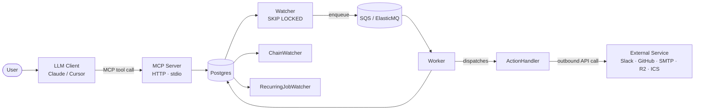

# Task Scheduler MCP

**🌐 繁體中文** | [English](README.md)

一個可自行托管的 MCP 伺服器，以持久化 HTTP 服務方式運行 — **7 個工具 · 4 個資源 · 2 個提示詞** — 讓 LLM 客戶端能夠排程、串接並取消以 Postgres + SQS 為後端的週期性任務。

[](https://github.com/PaynePew/task_scheduler_mcp/actions) [](https://scheduler.paynepew.dev) [](https://status.paynepew.dev)

---

<!-- HERO-GIF placeholder — filled in W4-S17b -->

---

## §1 適用對象

為有需要的開發者而打造：運行自己的 webhooks/API，並希望透過自然語言 LLM 對話來排程任務，且需要在對話結束後仍能持久保存可稽核的執行記錄。

**支援的 MCP 客戶端：** Claude Desktop · Cursor · Claude in Chrome · MCP Inspector
**不支援：** ChatGPT（Custom GPT Actions ≠ MCP 協議）

---

## §2 系統架構



MCP 伺服器持久化 `Job` 與 `JobRun` 資料列。**Watcher** 透過 `FOR UPDATE SKIP LOCKED` 認領到期的執行，並將其推送至佇列。**Worker** 分派至型別化的 **ActionHandler**。**ChainWatcher** 和 **RecurringJobWatcher** 消費僅能附加的 `run_events` outbox — 兩者從不輪詢可變狀態。

---

## §3 使用方式

### 自行托管（推薦）

```bash
git clone https://github.com/PaynePew/task_scheduler_mcp
cd task_scheduler_mcp && cp .env.example .env
docker compose --profile full up -d
```

Claude Desktop 設定（`~/Library/Application Support/Claude/claude_desktop_config.json`）：

```json
{ "mcpServers": { "task-scheduler": {
  "url": "http://localhost:8000/mcp",
  "transport": "streamable-http",
  "headers": { "X-User-Id": "me" }
}}}
```

持續運行托管：在全新的 Ubuntu 24.04 主機上執行 `bin/setup-vps.sh`（Docker + Caddy + ufw + 每夜 Postgres 備份 + systemd 重開機自動重啟）。

### 公開示範（僅供瀏覽）

```bash
curl https://scheduler.paynepew.dev/healthz   # → {"ok":true,"db":"connected"}
MCP_USER_ID=demo npx @modelcontextprotocol/inspector https://scheduler.paynepew.dev/mcp
```

無驗證 — 任何人都可以透過猜測你的 `X-User-Id` 讀取你的任務。凡是重要的資料請自行托管。

### 瀏覽設計（作品集路徑）

[`docs/adr/`](docs/adr/) — 42 個 ADR · [`docs/PRD/`](docs/PRD/) — 衝刺規格 · 設計決策（詳見下方 §7）

---

## §4 為什麼用 HTTP，而非 stdio

Stdio MCP 是子行程 — 對話關閉時就會消亡。排程器必須在不依賴任何客戶端開啟的情況下，依照掛鐘時間觸發任務。請見 [ADR-006](docs/adr/ADR-006-mcp-transport-dual-stdio-http.md)。

---

## §5 部署架構

<!-- DIAGRAM-D2 infrastructure diagram placeholder — filled in W4-S17a -->

| | VPS（運行時 — 已上線） | Fargate（設計文物） |
|---|---|---|
| **平台** | AWS Lightsail 東京 | ECS Fargate / RDS / ALB / SQS |
| **每月費用** | ~$5 | ~$117–145 閒置 |
| **TLS** | Caddy 自動 ACME | ACM + ALB |
| **資料** | 容器內 Postgres + R2 備份 | RDS Multi-AZ 就緒 |
| **驗證方式** | 每次 CI/CD 推送 | `validate-fargate.yml`（W4） |

---

## §6 開發路線

### W3 驗收層

| 層次 | 描述 | 狀態 |
|---|---|---|
| L1 | 程式碼綠燈 — CI + `terraform plan` 通過 | ✅ W3 |
| L2 | 透過 `bin/setup-vps.sh` 完成全新 VPS 配置 | ✅ W3 |
| L3 | 上線 URL — `scheduler.paynepew.dev/healthz` 回傳 200 | ✅ W3 |
| L4a | Echo 週期任務在 5 分鐘內觸發 ≥ 2 次 | ✅ W3 |
| L4b | 串接 A→B 完成；`chain_watcher` 確認存活 | ✅ W3 |
| L5 | Better Stack ≥ 24 小時綠燈；R2 備份 + 還原演練 | ✅ W3 |
| L6 | Fargate `validate-fargate.yml` 通過；費用 < $5 | ⬜ W4 |
| L7 | 示範影片 / 替代文物 | ⬜ W4 |

### W4 驗收關卡

| 關卡 | 描述 | 狀態 |
|---|---|---|
| G1 | CI 綠燈；測試覆蓋率達標 | ⬜ |
| G2 | 5 個新處理器已加入登錄表；`task.list_actions.v1` 回傳 7 | ⬜ |
| G3 | Digest 工作流上線 — 生產 VPS 連續 ≥ 5 個工作日發送 Slack 訊息 | ⬜ |
| G4 | `tasks://recent-results` 可查詢；回傳真實 24 小時資料 | ⬜ |
| G5 | 落地頁上線 — `curl https://scheduler.paynepew.dev/` 回傳 200 + HTML | ⬜ |
| G6 | 速率限制 — 整合測試：第 1001 次建立請求被拒絕 | ⬜ |
| G7 | Fargate 證據 — 乾跑 + 錄製跑皆通過；費用 < $5 | ⬜ |
| G8 | 視覺文物 — README 中含 Hero GIF + 4 張截圖 + 3 張圖表 | ⬜ |
| G9 | README 精修 + i18n — EN + zh-TW，約 150 行 | ⬜ |
| G10 | ADR 群組 — 13 個新 W4 ADR 已合併 | ⬜ |

---

## §7 設計決策（ADR）

W1 範疇、語言、資料存儲、佇列、schema、模組佈局（[ADR-001–023](docs/adr/)）：

| ADR | 決策 |
|---|---|
| [ADR-001](docs/adr/ADR-001-project-scope.md) | 專案範疇 |
| [ADR-002](docs/adr/ADR-002-implementation-language-python.md) | Python |
| [ADR-003](docs/adr/ADR-003-primary-data-store-postgres.md) | Postgres 為主要存儲 |
| [ADR-006](docs/adr/ADR-006-mcp-transport-dual-stdio-http.md) | 雙模 stdio + HTTP MCP 傳輸 |
| [ADR-007](docs/adr/ADR-007-watcher-ha-skip-locked.md) | Watcher HA 透過 `SKIP LOCKED` |
| [ADR-008](docs/adr/ADR-008-message-queue-sqs.md) | SQS / ElasticMQ 佇列 |
| [ADR-009](docs/adr/ADR-009-database-schema-outbox.md) | 三表 schema + 交易式 outbox |
| [ADR-013](docs/adr/ADR-013-action-catalog-typed-registry.md) | 型別化 action 登錄表 |
| [ADR-014](docs/adr/ADR-014-mcp-tool-surface-v1.md) | MCP 工具介面 v1 |
| [ADR-018](docs/adr/ADR-018-no-server-side-llm-in-w2.md) | W2 不使用伺服器端 LLM |
| [ADR-018-amended](docs/adr/ADR-018-amended-w4-reconsidered-stays-llm-agnostic.md) | W4 重新審視 — 維持 LLM 中立 |

W3 部署群組（[ADR-024–031](docs/adr/)）：

| ADR | 決策 |
|---|---|
| [ADR-024](docs/adr/ADR-024-tier-scoping-and-w3-cut-scope.md) | W3 層次範疇 |
| [ADR-025](docs/adr/ADR-025-network-topology-w3-public-ecs-private-rds.md) | 網路拓撲 |
| [ADR-026](docs/adr/ADR-026-ecs-service-topology-and-replica-count.md) | ECS 服務拓撲 |
| [ADR-027](docs/adr/ADR-027-deployment-target-pivot-vps-first-aws-as-design-artifact.md) | VPS 優先運行；Fargate 作為設計文物 |
| [ADR-028](docs/adr/ADR-028-caddy-over-nginx-for-vps-reverse-proxy.md) | 採用 Caddy 取代 nginx |
| [ADR-029](docs/adr/ADR-029-vps-deployment-mechanics-ghcr-push-ssh-pull-containerized-data.md) | VPS 部署機制 |
| [ADR-030](docs/adr/ADR-030-vps-operational-concerns-backup-monitoring-fargate-validation.md) | 運維考量 |
| [ADR-031](docs/adr/ADR-031-monitoring-better-stack-over-uptimerobot.md) | 採用 Better Stack 監控 |

W4 行動衝刺群組：

| ADR | 決策 |
|---|---|
| [ADR-032](docs/adr/ADR-032-secrets-aware-action-handlers-and-env-var-substitution.md) | 透過環境變數替換管理密鑰 |
| [ADR-033](docs/adr/ADR-033-inter-handler-data-flow-via-job-run-result.md) | 透過 `JobRun.result` 實現跨處理器資料傳遞 |
| [ADR-037](docs/adr/ADR-037-tasks-recent-results-mcp-resource-as-briefing-surface.md) | `tasks://recent-results` 簡報介面 |
| [ADR-038](docs/adr/ADR-038-mcp-call-as-future-direction.md) | Worker 作為 MCP 客戶端 *（延後 — v2）* |
| [ADR-039](docs/adr/ADR-039-plan-abstraction-as-future-direction.md) | Plan 抽象層 *（延後 — v2）* |
| [ADR-040](docs/adr/ADR-040-predicate-based-chain-as-future-direction.md) | 條件式串接 *（延後 — v2）* |
| [ADR-041](docs/adr/ADR-041-static-landing-page-and-caddy-path-routing.md) | 靜態落地頁 + Caddy 路徑路由 |
| [ADR-042](docs/adr/ADR-042-postgres-backed-rate-limiting.md) | Postgres 速率限制 |
| [ADR-044](docs/adr/ADR-044-project-rename-to-task-scheduler-mcp.md) | 專案重新命名為 `task_scheduler_mcp` |
| [ADR-048](docs/adr/ADR-048-calendar-digest-ics-action-design.md) | 透過簽署 ICS URL 實現日曆摘要 |

---

## §8 MCP 介面

<!-- HANDLER-DETAIL placeholder — descriptions filled in W4-S15b after handlers ship -->

**工具（7）：** `task.create.v1` · `task.list.v1` · `task.status.v1` · `task.cancel.v1` · `task.list_actions.v1` · *（W4 工具待 S15b）*

**資源（4）：** `tasks://list` · `tasks://actions` · `tasks://job/{job_id}` · `tasks://recent-results`

**提示詞（2）：** `daily_review` · `setup_summary`

**功能特色：** 週期性（cron）任務 · 任務串接（`trigger_on_job_id`）· 取消語意 · 透過 `JobRun.result` 實現跨處理器資料傳遞

**支援的 MCP 客戶端：** Claude Desktop · Cursor · Claude in Chrome · MCP Inspector
**不支援：** ChatGPT（Custom GPT Actions 使用不同協議 — 非 MCP）

---

## §9 本地開發

完整的 11 步驟點選流程請見 [docs/W2-VERIFICATION.md](docs/W2-VERIFICATION.md)。

```bash
uv sync                             # 安裝依賴
cp .env.example .env
docker compose up -d postgres elasticmq
uv run pytest -m "not integration"  # 單元測試
uv run pytest -m integration        # 需要運行中的服務
uv run ruff check . && uv run ruff format --check .
```

```bash
# stdio 檢查器（不需要 compose 堆疊）
MCP_USER_ID=local-dev MCP_USER_TZ=UTC \
  npx @modelcontextprotocol/inspector uv run python -m app.entrypoints.mcp_stdio
```

在檢查器中預期顯示：**7 個工具 · 4 個資源 · 2 個提示詞**（W4 完成）/ **5 個工具 · 3 個資源 · 2 個提示詞**（W3 基線）。
