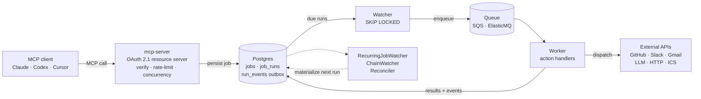
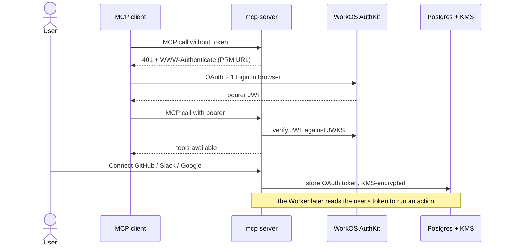

# Owl Task Scheduler MCP

**繁體中文** | [English](README.md)

一個可自行托管、支援多租戶 (multi-tenant) 的 MCP 伺服器，把自然語言對話變成會持續執行的排程任務。你只要對 Claude 或 Codex 說「每個工作日早上九點，把我的 GitHub issues 摘要後貼到 Slack」，這個任務在你關掉對話之後仍會照排程持續觸發。底層用 Postgres + SQS，目前實際跑在一台每月 5 美元的 VPS 上。

[](https://github.com/PaynePew/task_scheduler_mcp/actions) [](https://scheduler.paynepew.dev) [](https://status.paynepew.dev)

---

## 這是什麼

大多數 MCP 伺服器走 stdio，所以它的生命週期跟對話視窗綁在一起，對話關了它就死了。但排程器不能這樣運作：一個「每週一早上十點」要觸發的任務，必須在沒有任何對話開著的情況下也照樣跑。所以這套東西是一個常駐的 HTTP 服務，有自己的資料庫與 worker pool。對話端 (chat client) 只透過 MCP 建立與查詢任務，真正的排程是由伺服器依掛鐘時間 (wall-clock time) 完成的。

線上有一個多租戶實例跑在 [scheduler.paynepew.dev](https://scheduler.paynepew.dev)。它用 OAuth 2.1 驗證每個使用者，動作 (action) 跑在該使用者自己的受限權杖 (scoped token) 上，並用配額 (quota)、速率限制 (rate limit) 與載荷卸除 (load shedding) 守住一台小機器。你大概兩分鐘就能連上去用，或是把整個 repo clone 下來自己跑。

**支援的客戶端：** Claude Desktop、Claude Code、Codex CLI、Cursor、MCP Inspector。

## 關鍵技術點

- 持久性 (persistence) 是整件事的重點。因為排程器是個長壽命的 HTTP 服務、有自己的資料庫，不是隨客戶端死掉的子行程 (subprocess)，所以任務能撐過對話結束（[ADR-006](docs/adr/ADR-006-mcp-transport-dual-stdio-http.md)）。
- 真的有做身分驗證，不是靠一個 header。公開端點是一個 OAuth 2.1 資源伺服器 (resource server)，由 WorkOS AuthKit 擔任授權伺服器 (authorization server)。使用者身分是一個經過驗證的 JWT 主體 (subject)，所以一個使用者永遠讀不到、也取消不了另一個人的任務（[ADR-053](docs/adr/ADR-053-layer1-authorization-server-workos-authkit.md)、[ADR-049](docs/adr/ADR-049-public-product-multi-tenant-oauth-delegation.md)）。
- 從不儲存你的原始密鑰 (raw secret)。GitHub、Slack、Gmail 這些動作跑在每位使用者自己的 OAuth 權杖上，這些權杖是受限、可撤銷的，用 AWS KMS 信封加密 (envelope encryption) 加密後才落地，過期時自動換新（[ADR-054](docs/adr/ADR-054-layer2-token-storage-aws-kms-envelope-encryption.md)）。
- 資料模型是為了避免競態 (race condition) 而設計的。每一次狀態變更都在同一個交易 (transaction) 裡寫進一個僅能附加 (append-only) 的 outbox，而各個 watcher 讀的是這份事件日誌，不去輪詢 (poll) 可變狀態（[ADR-009](docs/adr/ADR-009-database-schema-outbox.md)）。執行 (run) 的建立只有單一擁有者，所以串接 (chained) 與週期性 (recurring) 任務不會重複生成（[ADR-065](docs/adr/ADR-065-run-source-dichotomy-and-run-materializer.md)）。
- 它跑在每月 5 美元上，而且在負載下站得住。各個 watcher 用 `FOR UPDATE SKIP LOCKED` 認領工作，所以可以跑好幾個而不需要 leader 選舉。伺服器會在邊緣 (edge) 卸載流量、限制併發 (concurrency)，並在佇列堆積時施加背壓 (backpressure)（[ADR-007](docs/adr/ADR-007-watcher-ha-skip-locked.md)、[ADR-057](docs/adr/ADR-057-overload-protection-load-shedding-concurrency.md)）。
- 每個決策都寫下來了。60 多份 ADR 涵蓋範疇、語言、資料存儲、傳輸、認證與安全模型，所以推理過程是可稽核的，而不是只存在某個人腦裡。

## 系統架構

兩個視角。第一個是任務生命週期：一個請求如何變成準時觸發的排程執行。第二個是在這一切之前發生的認證與密鑰握手。

### 執行流程



一次工具呼叫透過 Caddy 到達 `mcp-server`。伺服器驗證 bearer 權杖、檢查呼叫者的速率限制與配額，然後寫入一個 `Job` 以及它的第一個 `JobRun`。**Watcher** 掃描未來五分鐘內到期的執行，用 `FOR UPDATE SKIP LOCKED` 認領它們，所以可以同時跑好幾個 watcher 而互不踩線。被認領的執行進入佇列，**Worker** 取出一個，分派 (dispatch) 給對應的型別化動作處理器 (typed action handler)，再把結果與一筆狀態事件寫回 Postgres。

後續的 watcher 從不輪詢那個可變的狀態欄位，它們讀的是僅能附加的 `run_events` outbox：**RecurringJobWatcher** 物化 (materialize) 下一個 cron 週期的執行，**ChainWatcher** 在某個觸發任務到達終態 (terminal status) 時，把下游任務從 `WAITING` 翻成 `PENDING`。**Reconciler** 則負責清理那些因 worker 當機而被孤立的執行。

### 認證與密鑰



一個未認證的呼叫會拿到 `401` 與一個 `WWW-Authenticate` 挑戰，這個挑戰指向受保護資源中繼資料 (Protected Resource Metadata，RFC 9728) 端點，客戶端就是靠它發現登入流程。瀏覽器登入後，客戶端送上一個 WorkOS bearer JWT，伺服器對 JWKS 驗證它。連接一個 app 是 `/connections` 上另一道逐 provider 的 OAuth 同意；得到的權杖加密後儲存，worker 在執行時讀取它。

## 快速上手

有三種連法，它們用不同的傳輸 (transport) 與不同的身分來源。混用是最常見的踩雷點，所以選一條路、從頭走到尾。

|                    | A. 線上托管                              | B. 自行托管（HTTP）                  | C. 自行托管（stdio）                       |
|--------------------|------------------------------------------|-------------------------------------|--------------------------------------------|
| MCP 傳輸           | streamable HTTP over TLS                 | streamable HTTP                     | stdio 子行程                               |
| MCP 端點           | `https://scheduler.paynepew.dev/mcp`     | `http://localhost:8000/mcp`         | `uv run python -m app.entrypoints.mcp_stdio` |
| 你是誰             | WorkOS OAuth（驗證過的 JWT `sub`）       | `X-User-Id` header（trust-only）    | `MCP_USER_ID` 環境變數（trust-only）       |
| 連接你的 app       | `scheduler.paynepew.dev/connections`     | `localhost:8000/connections`        | `localhost:8000/connections`               |
| 先要起什麼         | 不用                                     | `docker compose --profile full up -d` | 同一套 compose，再按需 spawn stdio         |

> trust-only 的 `X-User-Id` 與 `MCP_USER_ID` 路徑會無條件相信你給的值。在你自己的機器上沒問題，但絕對不要暴露到公開網路上：任何人猜到 header 就能讀你的任務。線上托管那條路走的是真正的 OAuth。

當某個動作需要一個你還沒設定的 OAuth 連線時，伺服器會回一個 `MISSING_CONNECTION` 錯誤，外加一個用它自己的 `CONNECTIONS_BASE_URL` 組出來的 `connect_url`。如果你的客戶端指向線上伺服器、卻跑去本機伺服器連接 app（或反過來），兩邊握的是不同身分，每次動作呼叫都會默默失敗。讓兩端待在同一條路上。

### A. 線上托管：不用安裝

這是最快的試用方式，兩分鐘，不用 clone。

**Claude Desktop**（Settings → Connectors → Add custom connector）：名稱填 `owl-scheduler`，URL 填 `https://scheduler.paynepew.dev/mcp`，其餘留空。點 Connect，在跳出的瀏覽器視窗登入，工具就會出現在對話裡。完整步驟：[docs/guides/claude-desktop-quickstart.md](docs/guides/claude-desktop-quickstart.md)。

**Claude Code：**

```bash
claude mcp add --transport http owl-scheduler https://scheduler.paynepew.dev/mcp
```

**Codex CLI**（`~/.codex/config.toml`）：

```toml
[mcp_servers.owl-scheduler]
url = "https://scheduler.paynepew.dev/mcp"
```

接著跑 `codex mcp login owl-scheduler` 完成瀏覽器登入。

登入後，開啟 [scheduler.paynepew.dev/connections](https://scheduler.paynepew.dev/connections)，確認頂端顯示的名字跟你剛剛用的帳號一致，再依需要對 GitHub、Slack 或 Google 點 Connect。健康檢查：`curl https://scheduler.paynepew.dev/healthz` 會回 `{"ok":true,"db":"connected"}`。

### B. 自行托管（HTTP）：上線部署推薦這條

```bash
git clone https://github.com/PaynePew/task_scheduler_mcp
cd task_scheduler_mcp
cp .env.docker.example .env.docker   # compose 讀的是這份，不是 .env
cp .env.example .env                 # 僅供 host-side uv（測試、alembic）
docker compose --profile full up -d
```

這會起九個服務：Postgres、ElasticMQ、一次性的 migrator、`mcp-server`、watcher、worker，以及 recurring、chain、reconciler 三個 watcher。

把客戶端指向本機端點。在 trust-only 模式下，`X-User-Id` header 就是你的身分。

```bash
# Claude Code
claude mcp add --transport http owl-scheduler http://localhost:8000/mcp --header "X-User-Id: me"
```

```toml
# Codex CLI config: ~/.codex/config.toml
[mcp_servers.owl-scheduler]
url = "http://localhost:8000/mcp"
http_headers = { "X-User-Id" = "me" }
```

開啟 `http://localhost:8000/connections`，確認它顯示 `Signed in as me`（跟你的 header 一致），再逐一連接 provider。要放上公開網路時，編輯 `.env.docker`：

- 設 `CONNECTIONS_BASE_URL=https://yourdomain.tld`，讓 OAuth callback 與 metadata 使用公開 host。
- 設定 WorkOS，讓公開端點要求真正的 bearer 權杖，而不是 trust-only header。
- 在全新的 Ubuntu 24.04 機器上，`bin/setup-vps.sh` 會裝好 Docker、自動 TLS 的 Caddy、防火牆、每夜 Postgres 備份，以及 systemd 自動重啟。

透過 `http_call` 自帶 LLM：`action: "http_call"`，在 headers 或 body 引用 `${ANTHROPIC_API_KEY}`（執行時會替換，[ADR-032](docs/adr/ADR-032-secrets-aware-action-handlers-and-env-var-substitution.md)），並把變數名稱加進 `ALLOWED_TEMPLATE_VARS`。每位使用者的建立限制預設為 100 個任務/天、每分鐘爆衝 5 次，皆可調整（[ADR-055](docs/adr/ADR-055-public-abuse-cost-containment-posture.md)）。

### C. 自行托管（stdio）：Inspector 與開發便利路徑

stdio 的 MCP 伺服器是個子行程，對話結束就消亡（[見下方](#為什麼用-http而非-stdio)為什麼這對排程器通常是錯的）。它只適合 MCP Inspector 除錯或短期 dev。OAuth 儀表板還是在 HTTP web tier 上，所以整套 stack 還是要起來：

```bash
cp .env.docker.example .env.docker
cp .env.example .env
docker compose --profile full up -d   # web tier（給 /connections）加上 Postgres 與 queue
```

```toml
# Codex CLI config: ~/.codex/config.toml
[mcp_servers.owl-scheduler]
command = "uv"
args = ["run", "python", "-m", "app.entrypoints.mcp_stdio"]
cwd = "/path/to/task_scheduler_mcp"
env = { MCP_USER_ID = "me", MCP_USER_TZ = "UTC" }
```

```jsonc
// Claude Desktop / Cursor：客戶端按需 spawn 進程
{ "mcpServers": { "owl-scheduler": {
  "type": "stdio",
  "command": "uv",
  "args": ["run", "python", "-m", "app.entrypoints.mcp_stdio"],
  "env": { "MCP_USER_ID": "me", "MCP_USER_TZ": "UTC" }
}}}
```

stdio 進程與 web tier 各自從自己的環境讀 `MCP_USER_ID`，兩邊必須解析成同一個字串，否則你會用一個 user 連接 app、stdio 進程卻查另一個 user。開啟 `http://localhost:8000/connections`，確認 `Signed in as me` 跟你傳進去的 `MCP_USER_ID` 一致。

對 stdio 入口跑 MCP Inspector：

```bash
MCP_USER_ID=local-dev MCP_USER_TZ=UTC \
  npx @modelcontextprotocol/inspector uv run python -m app.entrypoints.mcp_stdio
```

### 為什麼用 HTTP，而非 stdio

stdio 的 MCP 伺服器是對話客戶端的子行程，對話一關就停。排程器必須在不管哪個客戶端開著的情況下，依掛鐘時間觸發，這只有長壽命服務做得到。程式碼同時保留兩種傳輸，因為 stdio 對本機除錯、以及 operator 自己低摩擦的存取，確實有用。見 [ADR-006](docs/adr/ADR-006-mcp-transport-dual-stdio-http.md)。

## MCP 介面

**工具 Tools（5）：** `task.create.v1`、`task.list.v1`、`task.status.v1`、`task.cancel.v1`、`task.list_actions.v1`。工具是 LLM 客戶端能呼叫的東西；`task.create.v1` 帶一個 `action` 欄位，指名下面其中一個處理器。

**動作 Actions（8）：** worker 真正執行的東西，依憑證取得方式分組。

| 動作 | 需要 | 做什麼 |
|---|---|---|
| `echo` | 無 | 把輸入回拋。建立與分派的冒煙測試。 |
| `llm_summarize` | 無 | 摘要文字或上游結果。固定提示詞，有 token 與預算上限。 |
| `llm_polish` | 無 | 把文字改寫得更通順。同樣是固定提示詞、有上限的路徑。 |
| `github_digest` | 你的 GitHub | 拉某個 repo 的 issues 與 PR。很適合當摘要的上游。 |
| `slack_post` | 你的 Slack | 把訊息貼到你工作區的某個頻道。 |
| `email_send` | 你的 Google | 用你的 Gmail 寄信。支援摘要串接。 |
| `http_call` | 僅限 operator | 帶 `${VAR}` 替換的通用 HTTP 呼叫。限部署者使用（SSRF 風險面）。 |
| `calendar_digest_ics` | 僅限 operator | 抓一份 ICS 行事曆，列出某個時間窗內的事件。 |

走 OAuth 的動作，跑在每位使用者自己的受限權杖上。兩個 LLM 動作只執行一個固定、有成本上限的轉換：不能自帶任意提示詞，也不能引用 `${VAR}`。模型釘死在便宜的 `gpt-4o-mini`，並有硬性的單次輸出 token 上限，以及每位使用者每日與全域每月的預算天花板，把成本框住（[ADR-052](docs/adr/ADR-052-operator-subsidized-llm-actions-fixed-prompt-and-caps.md)）。

**資源 Resources（4）：** `tasks://list`、`tasks://actions`、`tasks://job/{job_id}`、`tasks://recent-results`（最近 24 小時完成的執行，適合在連上時做個簡報）。

**提示詞 Prompts（2）：** `daily_review`、`setup_summary`。

**排程功能：** 立即 (immediate)、一次性 (one-shot，`scheduled_at`) 與週期性 (recurring，`cron_expr`，含 `@daily`／`@hourly` 等簡寫) 任務；任務串接（`trigger_on_job_id` 搭配 `trigger_on_status`）；取消語意；每位使用者的速率限制與配額。

## 排程是怎麼運作的

系統存三樣東西，把它們搞混就是大多數 bug 的來源。**`Job`** 是任務定義（跑什麼、何時跑、誰擁有）。**`JobRun`** 是這個任務的一次執行嘗試。**`RunEvent`** 是一次狀態轉換的不可變記錄。一個週期性 `Job` 隨時間會有很多 `JobRun`；一次性的則剛好一個。

客戶端看到的是五個簡單狀態（`scheduled`、`running`、`completed`、`failed`、`cancelled`）。內部資料庫保留更細的八態狀態機，並在 MCP 邊界往下對應，所以精確的真相留在資料層，LLM 拿到的是它能推理的模型。

串接與週期性共用同一條規則：執行的建立只有單一擁有者，也就是 **RunMaterializer**。把下游任務「上膛 (arm)」這件事，發生在建立執行的同一個交易裡，所以一個串接或週期任務在建立的同時，下游一定被原子地上膛。如果上游產生執行的速度快過下游能完成的速度，重疊的那一拍會被刻意丟棄（載荷卸除）並留下稽核記錄，這保證每個任務最多只有一個執行中的執行。這修掉了一個真實的重複生成競態；推理過程在 [ADR-065](docs/adr/ADR-065-run-source-dichotomy-and-run-materializer.md) 與 [CONTEXT.md](CONTEXT.md)。

## 安全模型

公開部署（[ADR-049](docs/adr/ADR-049-public-product-multi-tenant-oauth-delegation.md)）分兩層建構。

**第一層，你是誰。** WorkOS AuthKit 是 OAuth 2.1 授權伺服器；這台伺服器只是資源伺服器。每個 `/mcp` 請求都要帶一個有效的 WorkOS bearer 權杖，並對 JWKS 驗證，連同 audience 與 resource 綁定（RFC 8707）一起檢查，以擋掉混淆代理人 (confused deputy) 攻擊。伺服器發布受保護資源中繼資料 (Protected Resource Metadata，RFC 9728)，並用 `401` 加 `WWW-Authenticate` 挑戰回應未認證的請求，MCP 客戶端就是靠這個發現登入流程。`user_id` 是驗證過的權杖主體，所以租戶隔離 (tenant isolation) 是結構性的。

**第二層，你能對什麼下手。** 每位使用者透過 `/connections` 頁上的 Connect 按鈕，連接自己的 GitHub、Slack 或 Google 帳號。得到的 OAuth 權杖用 AWS KMS 信封加密落地（每次寫入用一把新的資料金鑰；金鑰材料從不離開 KMS），過期時自動換新。系統從不儲存公開使用者的原始長壽命密鑰。

憑證來自兩條互不重疊的軌道（[ADR-050](docs/adr/ADR-050-dual-credential-model-oauth-vs-operator-env.md)）：公開使用者用自己的 OAuth 連線，伺服器自己的動作則用 `${VAR}` 環境變數替換。會讀到這些伺服器端密鑰、或能打到任意 URL 的動作（`http_call`、`calendar_digest_ics`）僅限部署者使用，對其他人在 `task.create` 就被拒絕（[ADR-051](docs/adr/ADR-051-action-surface-tiering-public-oauth-vs-operator-only.md)）。

一顆 5 美元的核心，靠分層限制守住（[ADR-055](docs/adr/ADR-055-public-abuse-cost-containment-posture.md)、[ADR-057](docs/adr/ADR-057-overload-protection-load-shedding-concurrency.md)）：每位使用者的建立速率（100/天、5/分）、每人活躍週期任務上限（5）與總活躍任務上限（50）、全域週期任務天花板（500）、機器不健康時在邊緣卸載流量、在途併發上限，以及佇列堆積時的 `429` 背壓。每項限制都可由環境變數設定。結構化 JSON 日誌送到 Better Stack，帶每位使用者與每次執行的關聯欄位，且權杖從不寫進日誌（[ADR-056](docs/adr/ADR-056-observability-structured-json-logging-better-stack.md)）。

## 部署

線上實例跑在一台東京的 AWS Lightsail 機器上，每月約 5 美元再加大約 1 美元的 KMS。Caddy 用自動憑證終結 TLS，並反向代理到 app。Postgres 跑在容器裡，每夜備份到 Cloudflare R2。每一次推進 `main` 且通過 CI 的提交，都會透過 SSH 自動部署，而 `/healthz` 會回報正在跑的 commit SHA，讓你能確認線上是哪一版。

公開狀態頁在 [status.paynepew.dev](https://status.paynepew.dev) 追蹤可用率。Better Stack 每三分鐘從機器外部探測 `/healthz`，所以機器掛掉時監控仍然活著，並以 Email 與 Slack 告警；頁面顯示 30/60/90 天的可用率歷史。伺服器另外開了 `/healthz/shed`，Caddy 把它當健康檢查，在機器不健康時於邊緣丟棄流量（[ADR-031](docs/adr/ADR-031-monitoring-better-stack-over-uptimerobot.md)、[ADR-057](docs/adr/ADR-057-overload-protection-load-shedding-concurrency.md)）。

## 本地開發

Host-side 測試迴圈，不啟動 full stack：

```bash
uv sync
cp .env.example .env
docker compose up -d postgres elasticmq        # 只起 Postgres 與 queue
uv run alembic upgrade head
uv run pytest -m "not integration" && uv run pytest -m integration
uv run ruff check . && uv run ruff format --check .
```

如果你手邊有一份 production 風味的 `.env`，跑單元測試前先把它移開：KMS 與 WorkOS 的分支會改變行為、製造假性失敗。完整人工驗證流程：[docs/PRODUCTION-VERIFICATION.md](docs/PRODUCTION-VERIFICATION.md)。

## 設計決策

決策記錄成 ADR，放在 [docs/adr/](docs/adr/)，領域語言則在 [CONTEXT.md](CONTEXT.md)。最值得先讀的幾份：

| 主題 | ADR |
|---|---|
| 傳輸與資料模型 | [006](docs/adr/ADR-006-mcp-transport-dual-stdio-http.md) 雙模 stdio／HTTP、[009](docs/adr/ADR-009-database-schema-outbox.md) outbox schema、[007](docs/adr/ADR-007-watcher-ha-skip-locked.md) SKIP LOCKED watcher |
| 動作與串接 | [013](docs/adr/ADR-013-action-catalog-typed-registry.md) 型別化登錄表、[033](docs/adr/ADR-033-inter-handler-data-flow-via-job-run-result.md) 跨處理器資料面、[065](docs/adr/ADR-065-run-source-dichotomy-and-run-materializer.md) RunMaterializer |
| 公開認證與密鑰 | [049](docs/adr/ADR-049-public-product-multi-tenant-oauth-delegation.md) 多租戶部署、[053](docs/adr/ADR-053-layer1-authorization-server-workos-authkit.md) WorkOS、[054](docs/adr/ADR-054-layer2-token-storage-aws-kms-envelope-encryption.md) KMS 權杖、[050](docs/adr/ADR-050-dual-credential-model-oauth-vs-operator-env.md)／[051](docs/adr/ADR-051-action-surface-tiering-public-oauth-vs-operator-only.md) 憑證分層 |
| 成本與韌性 | [055](docs/adr/ADR-055-public-abuse-cost-containment-posture.md) 配額、[057](docs/adr/ADR-057-overload-protection-load-shedding-concurrency.md) 過載保護、[056](docs/adr/ADR-056-observability-structured-json-logging-better-stack.md) 結構化日誌、[031](docs/adr/ADR-031-monitoring-better-stack-over-uptimerobot.md) 外部監控 |

## 現況

線上實例已上線且為多租戶：OAuth 登入、每位使用者的連線、上面那八個動作、週期排程與串接，都在生產環境運作中。延後到後續版本的有：fan-in（一個任務讀多個上游）、更高層的 plan 抽象，以及讓 worker 自己當 MCP 客戶端（[ADR-038](docs/adr/ADR-038-mcp-call-as-future-direction.md) 到 [ADR-040](docs/adr/ADR-040-predicate-based-chain-as-future-direction.md)）。issue 與討論：[github.com/PaynePew/task_scheduler_mcp/issues](https://github.com/PaynePew/task_scheduler_mcp/issues)。
