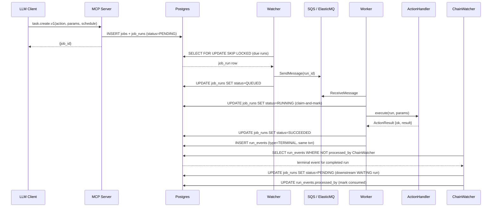

# ADR-009: Database schema — 3 tables (jobs / job_runs / run_events) with transactional outbox

- **Status**: Accepted
- **Date**: 2026-05-12
- **Source**: internal grilling session Q9 (local-only, not in git)
- **Related**: ADR-003 (Postgres), ADR-007 (Watcher HA), ADR-013 (action catalog)

## Context

At-least-once execution + recurring jobs + linear chaining must coexist without race conditions. The natural temptation is to mutate `job_runs.status` and have downstream watchers poll it — but that race-conditions when retries flip the status briefly between two reads.

## Decision

**Three tables:**

- **`jobs`** — mutable definition (action, params, schedule, idempotency_key, chaining fields, LLM-bonus fields).
- **`job_runs`** — execution instance, partitioned by `time_bucket`. W1 implements `time_bucket` as a column + composite PK `(time_bucket, run_id)` + partial index `(time_bucket, scheduled_at) WHERE status IN ('PENDING','WAITING')`. W2 upgrades to native `PARTITION BY RANGE`.
- **`run_events`** — append-only **outbox**. Every status transition writes one event in the **same transaction** as the `job_runs.status` update. `processed_by` JSONB column tracks which downstream watcher has consumed each event.

`RecurringJobWatcher` and `ChainWatcher` consume `run_events` (immutable history), never `job_runs.status` (mutable). Both advance their own cursor via the `processed_by` column.

Two access-pattern indexes:

- `idx_jobs_user_created (user_id, created_at DESC)` — serves `task.list.v1`. (Equivalent to a DDB GSI with PK=user_id, SK=created_at.)
- `idx_job_runs_due (time_bucket, scheduled_at) WHERE status IN ('PENDING','WAITING')` — the watcher's hot query.

We deliberately **do not** physically partition `jobs` by `user_id`. At prototype scale, an index achieves per-user locality without the migration cost of partitioning.

## Alternatives considered

- **Single table with status mutated in place** — vulnerable to status-flap races during retry; can't represent recurring history.
- **Two tables (jobs + job_runs, no outbox)** — same race-condition class for downstream watchers polling `job_runs.status`.
- **DynamoDB Streams as outbox** — couples us to AWS earlier than necessary; ADR-003 already chose Postgres.
- **Partition `jobs` by `user_id`** — premature for prototype scale; index suffices.

## Consequences

- Every status mutation costs 2 writes (status + event). Acceptable at W1 scale; revisit if W2 event volume explodes.
- Audit trail is free.
- Schema includes W2 bonus columns (`cron_expr`, `trigger_on_job_id`, `trigger_on_status`, `raw_user_input`, `parsing_metadata`) from day 1 to avoid W2 migration churn.
- W1 partitioning via column-only means watcher queries are still O(log n) within the current `time_bucket`; W2 native partitioning makes pruning explicit.
- Full schema lives in `.doc/learn/system-design.md` § 7.4 — this ADR records *why*, not the column list.

## Event flow (D3)

Sequence from task creation through chained downstream dispatch:

